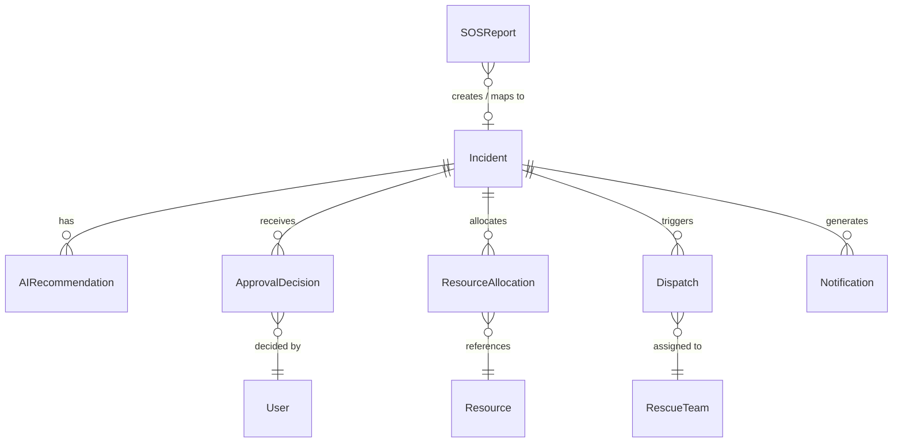

# Database Architecture

This document outlines the actual database models and relationships used in Sahaya AI, based on the implementation in `backend/models`.

## Core Models

### SOSReport
- **Purpose**: Represents an initial, unstructured SOS submission from a citizen (via web, phone, etc.).
- **Important Fields**: `tracking_token`, `source_type`, `raw_content`, `media_url`, `latitude`, `longitude`, `is_spam`, `needs_manual_review`, `processed`, `incident_id`.
- **Relationships**: Many-to-One with `Incident`.
- **Created By**: `POST /api/v1/sos` endpoint when citizen submits report.
- **Updated By**: `triage_service` and `sos_service` (sets `processed` or links to `incident`).

### Incident
- **Purpose**: The structured, triaged emergency event created by the AI processing layer from one or more `SOSReports`.
- **Important Fields**: `title`, `description`, `disaster_type`, `severity`, `priority_score`, `status` (NEW, UNDER_REVIEW, APPROVED, DISPATCHED, CLOSED), `location_text`, `latitude`, `longitude`, `affected_count_estimate`, `confidence_score`.
- **Relationships**: One-to-Many with `SOSReport`, `AIRecommendation`, `ApprovalDecision`, `ResourceAllocation`, `Dispatch`, `Notification`.
- **Created By**: `ai_pipeline.py` when it classifies a non-spam emergency.
- **Updated By**: Collector via approvals, dispatcher, or automatic system events.

### AIRecommendation
- **Purpose**: Stores the recommendations generated by the NVIDIA NIM AI for a given incident.
- **Important Fields**: `recommendation_type`, `recommendation_data` (JSON), `confidence_score`, `reasoning`, `is_active`.
- **Relationships**: Many-to-One with `Incident`.
- **Created By**: `triage_service.py` during initial triage or re-triage.

### ApprovalDecision
- **Purpose**: Captures the human-in-the-loop collector's decision on the AI recommendation.
- **Important Fields**: `decision` (APPROVED, REJECTED, MODIFIED), `notes`, `actor_id`.
- **Relationships**: Many-to-One with `Incident`.
- **Created By**: `POST /api/v1/incidents/{id}/approve` by Collector.

### ResourceAllocation & Dispatch
- **Purpose**: `ResourceAllocation` tracks specific resources assigned to an incident. `Dispatch` represents the actual operational movement of rescue teams/resources.
- **Relationships**: `Dispatch` and `ResourceAllocation` are both tied to `Incident`.

### Master Data Models (Facilities & Teams)
- **Hospital**: Stores hospitals, locations, and bed capacities. (Seeded)
- **Shelter**: Stores relief shelters and their occupancy. (Seeded)
- **RescueTeam**: Stores teams like NDRF or ODRAF. (Seeded)
- **Resource**: Stores equipment, vehicles, relief kits, boats. (Seeded)
- **User**: Stores login credentials and roles (ADMIN, COLLECTOR, RESPONDER). (Seeded)

## Entity Relationship Diagram

